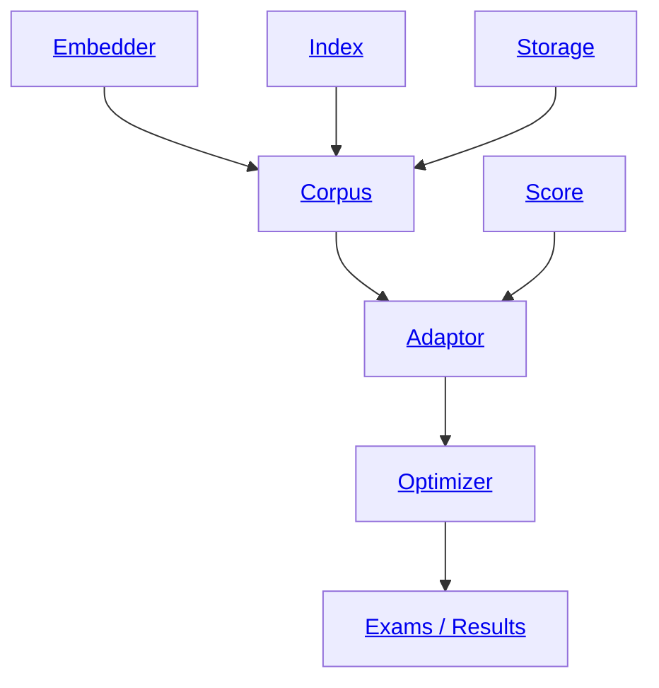

# Overview

```mermaid
graph TD;
    embedder --> corpus;
    index --> corpus;
    storage --> corpus;
    corpus --> adaptor;
    score --> adaptor;
    adaptor --> optimizer;
    optimizer --> exams;

    index[<a href='/references/indices'>Index</a>]
    storage[<a href='/references/storages'>Storage</a>]
    embedder[<a href='/references/embedders'>Embedder</a>]
    corpus[<a href='/references/corpora'>Corpus</a>]
    adaptor[<a href='/references/adaptors'>Adaptor</a>]
    score[<a href='/references/scores'>Score</a>]
    optimizer[<a href='/references/optimizers'>Optimizer</a>]
    exams[<a href='/references/exams'>Exams / Results</a>]
```
