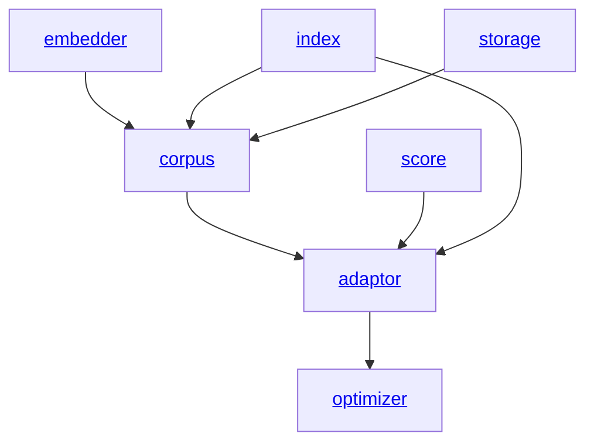

# Overview

```mermaid
graph TD;
    embedder --> corpus;
    index --> corpus;
    storage --> corpus;
    corpus --> adaptor;
    score --> adaptor;
    index --> adaptor;
    adaptor --> optimizer;

    index[<a href='/references/indices'>index</a>]
    storage[<a href='/references/storages'>storage</a>]
    embedder[<a href='/references/embedders'>embedder</a>]
    corpus[<a href='/references/corpora'>corpus</a>]
    adaptor[<a href='/references/adaptors'>adaptor</a>]
    score[<a href='/references/scores'>score</a>]
    optimizer[<a href='/references/optimizers'>optimizer</a>]
```
